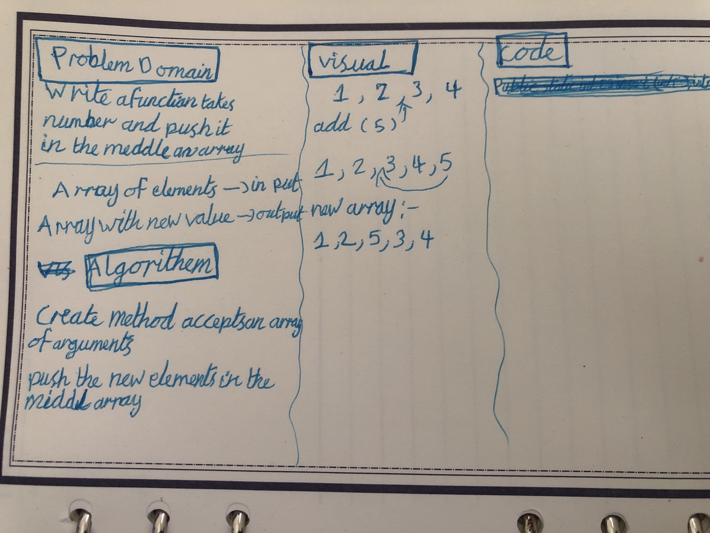
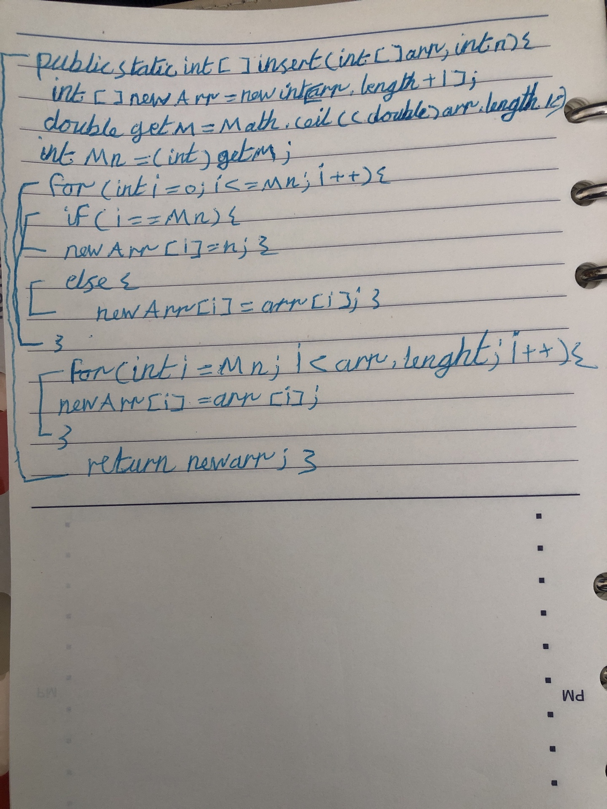

# array-insert-shift

#### which takes in an array and a value to be added. Without utilizing any of the built-in methods available to your language, return an array with the new value added at the middle index.

## Whiteboard Process

#### I have used simple way in array-insert-shift is switching and avoid using nested for loop because this will cost time and memory ... therefore my code represent  O(N) not O(N^2)... also I used pseudocode and algorithm to apply my idea before writing code .. then i verified my code with simple table to test me code .. and of course i put my code under edgecase.