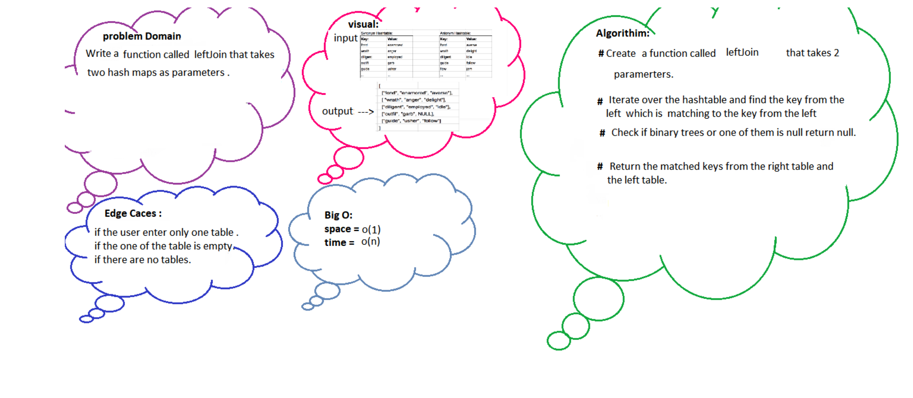

# Challenge Summary

<!-- Description of the challenge -->

Create tests for a happy situation, a scenario where no matches exist, cases where either table is
empty, and any additional edge cases at the very least. Create a new Hashmap with the common key as
the key and an array as the value to store the first table's value as the first element and the
second table's value as the second element. Iterate over the first table's keys. Grab the value of a
corresponding key in the second Hashmaps. Create an array in which the values from each table are
stored. In the new Hashmap, save that array with the key. Return the newly created List.

## Whiteboard Process

<!-- Embedded whiteboard image -->

## Approach & Efficiency

<!-- What approach did you take? Why? What is the Big O space/time for this approach? -->

The Big O space is O(n), and the time is O(n).
