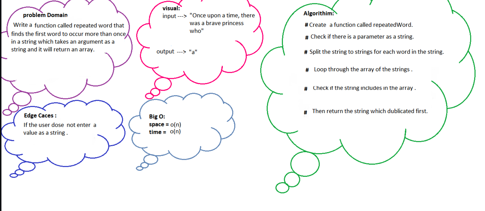

# Challenge Summary

- Write a function that accepts a lengthy string parameter, return the first word to occur more than once in that provided string.

## Whiteboard Process





## Approach & Efficiency
Big O

O(n) for complexity
O(n) for space

## Solution

```
public String RepeatedWord(String passage){
        Hashtable<String, Integer> hashtable = new Hashtable<String, Integer>();
        String[] words = passage.split("\\W+");
        int counter = 1;
        String firstRepeatedWord = null;

        for(String word: words){
            word = word.toLowerCase(Locale.ROOT);
            if(hashtable.get(word) != null){
                counter ++;
                if(firstRepeatedWord == null) firstRepeatedWord = word;
            }

            hashtable.put(word, counter);
        }
        return firstRepeatedWord;
    }
```