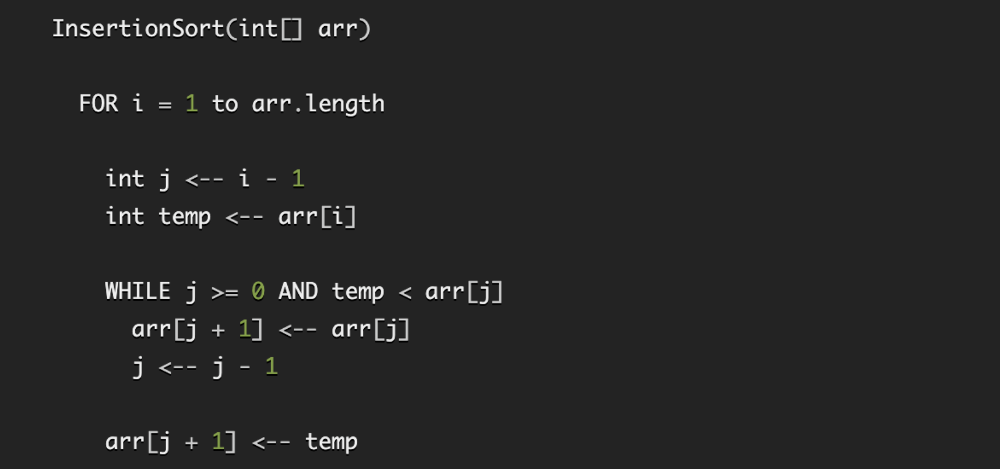
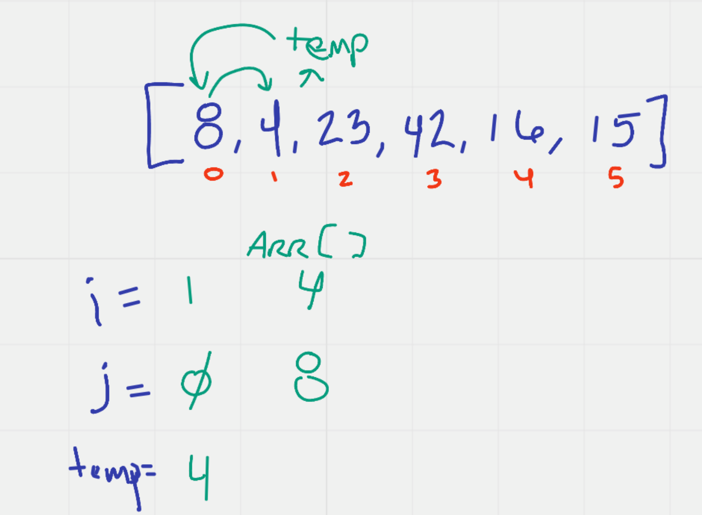
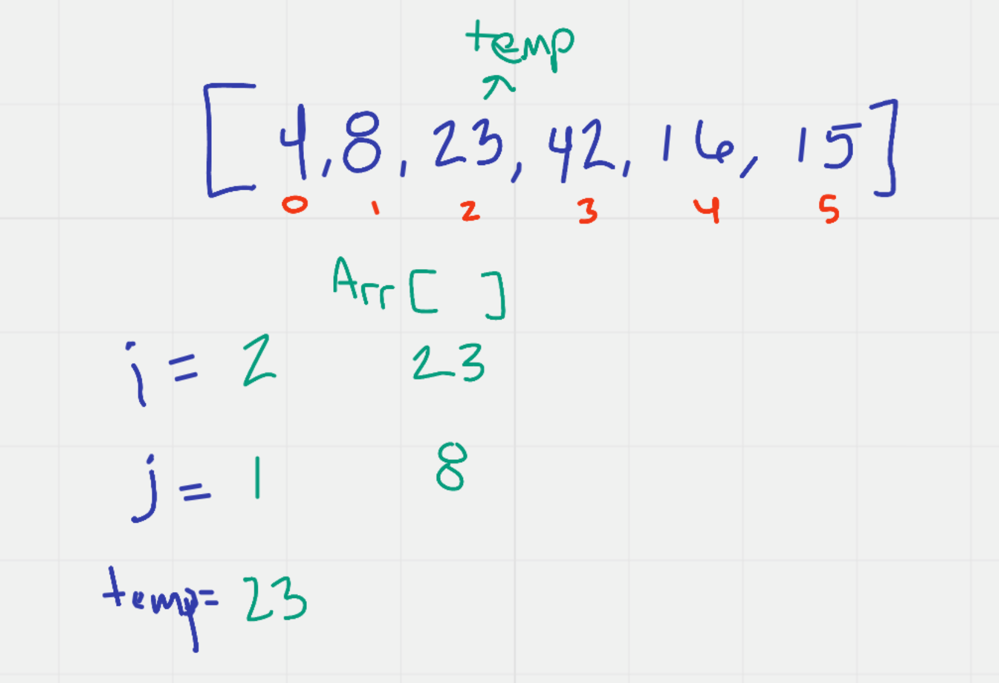
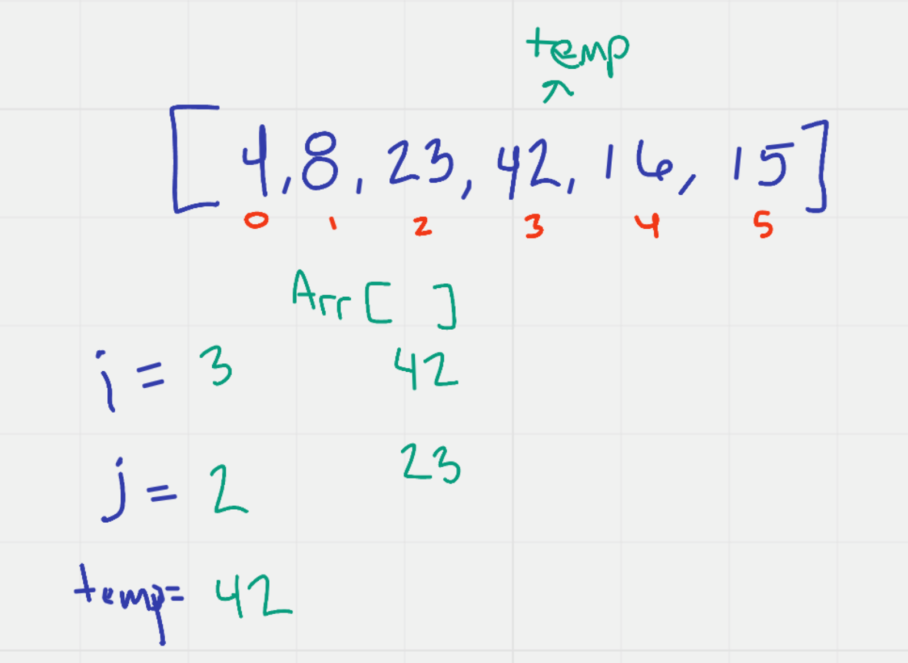
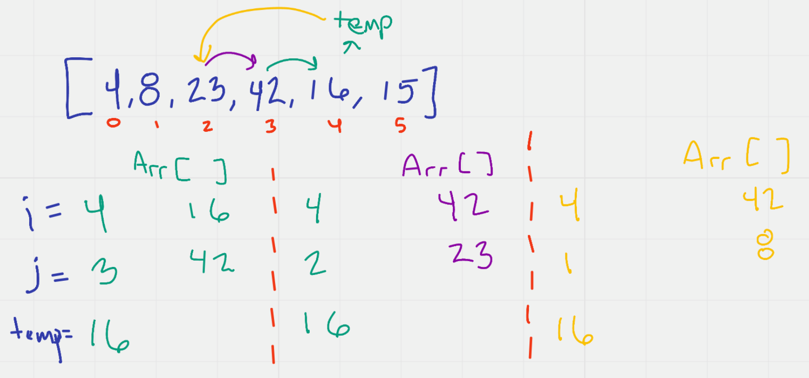
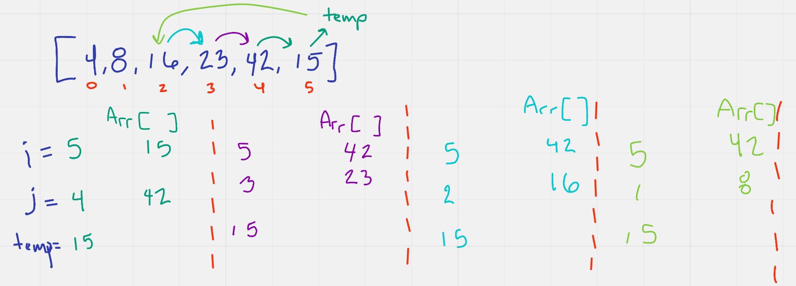

# Insertion Sort Array 

In this article I am going to explain how the Insertion Sort method
for sorting an array works. For this article, I am going to be using
the sample array as follows: [8,4,23,42,16,15]. 

The Insertion Sort method/function should return the sample array sorted
from smallest to largest as such: [4,8,15,16,23,42].
The entire method is completed within one FOR loop as follows: 

Pass 2

The second pass will swap the 4 and the 8.

Pass 3

The second pass will swap the 16 and the 42 and 23.

Pass 4

The second pass will swap the 15 and the 42 .

Pass 4

The second pass will swap the 15 and the 23.

Pass 5

The second pass will swap the 15 and the 16.

## Efficiency

Time: O(n^2) / Space: O(1)

