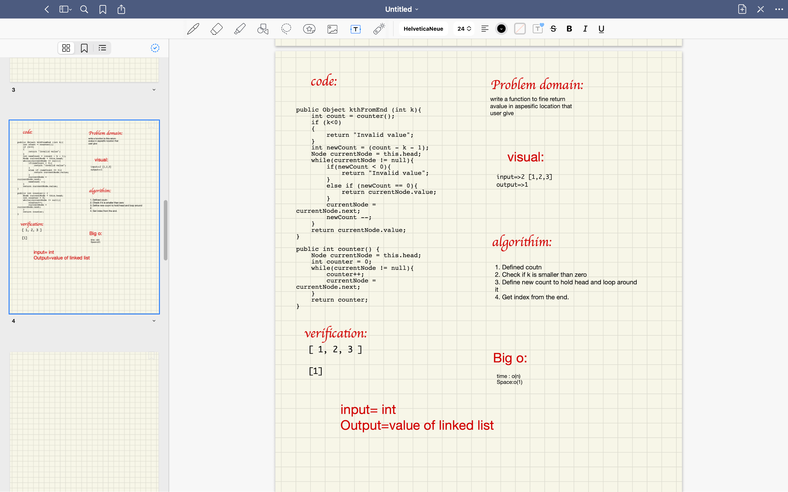
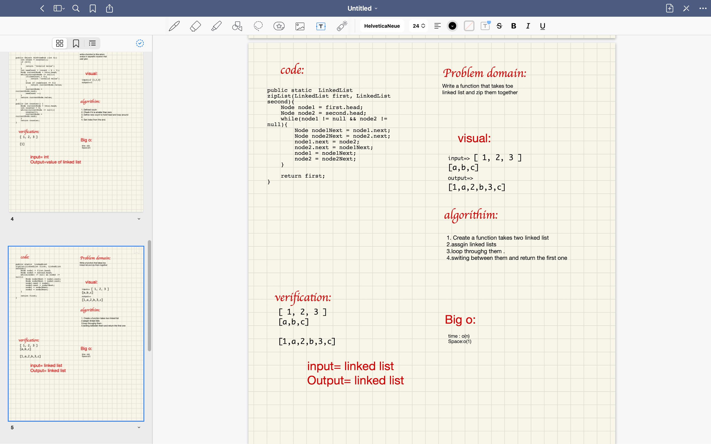
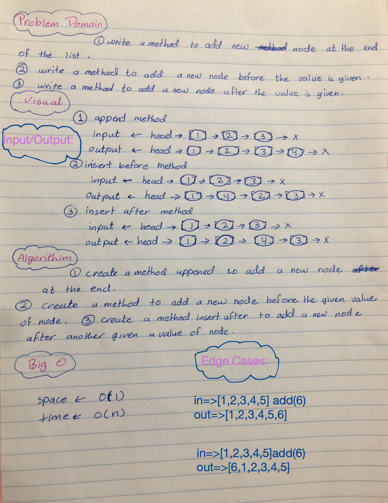

# Singly Linked List

<!-- Short summary or background information -->

Singly linked lists are the simplest type of linked list, Refers to the number of references the node has. A Singly linked list means that there is only one reference.

## Challenge

<!-- Description of the challenge -->

Create a Node class to Create a Linked List and write a methods to add the linked list, check of a value is in that list and print the list content as a String.
throw a custom, semantic error that describes what went wrong in calling the methods. and make a test for every possible cases of linked list.

## WhiteBoard
**Kth**

**ZIP**
 
## Approach & Efficiency

<!-- What approach did you take? Why? What is the Big O space/time for this approach? -->

approach I took: `while()` loop. This allows me to continually check that the Next node in the list is not null.

Time : O(n).
Space : O(1).

## API

<!-- Description of each method publicly available to your Linked List -->

**insert()**

Adds a new node with value from Arguments to the head of the list with an O(1) Time performance.

**includes()**

Method that accept a value and Indicates whether that value exists as a Node’s value somewhere within the list and Returns a true otherwise return false.

**toString()**

Returns: a string representing all the values in the Linked List, formatted as:
`"{ a } -> { b } -> { c } -> NULL"`

**append()**

adds a new node with the given value to the end of the list

**insert before()**

adds a new node with the given new value immediately before the first node that has the value specified

**insert after()**

adds a new node with the given new value immediately after the first node that has the value specified

**kth from end()**

You have access to the Node class and all the properties on the Linked List class as well as the methods created in previous challenges.

**Zip two linked lists()**

Write a function called zip lists

Arguments: 2 linked lists

Return: Linked List, zipped as noted below

Zip the two linked lists together into one so that the nodes alternate between the two lists and return a reference to the head of the zipped list.

Try and keep additional space down to O(1)

You have access to the Node class and all the properties on the Linked List class as well as the methods created in previous challenges.

