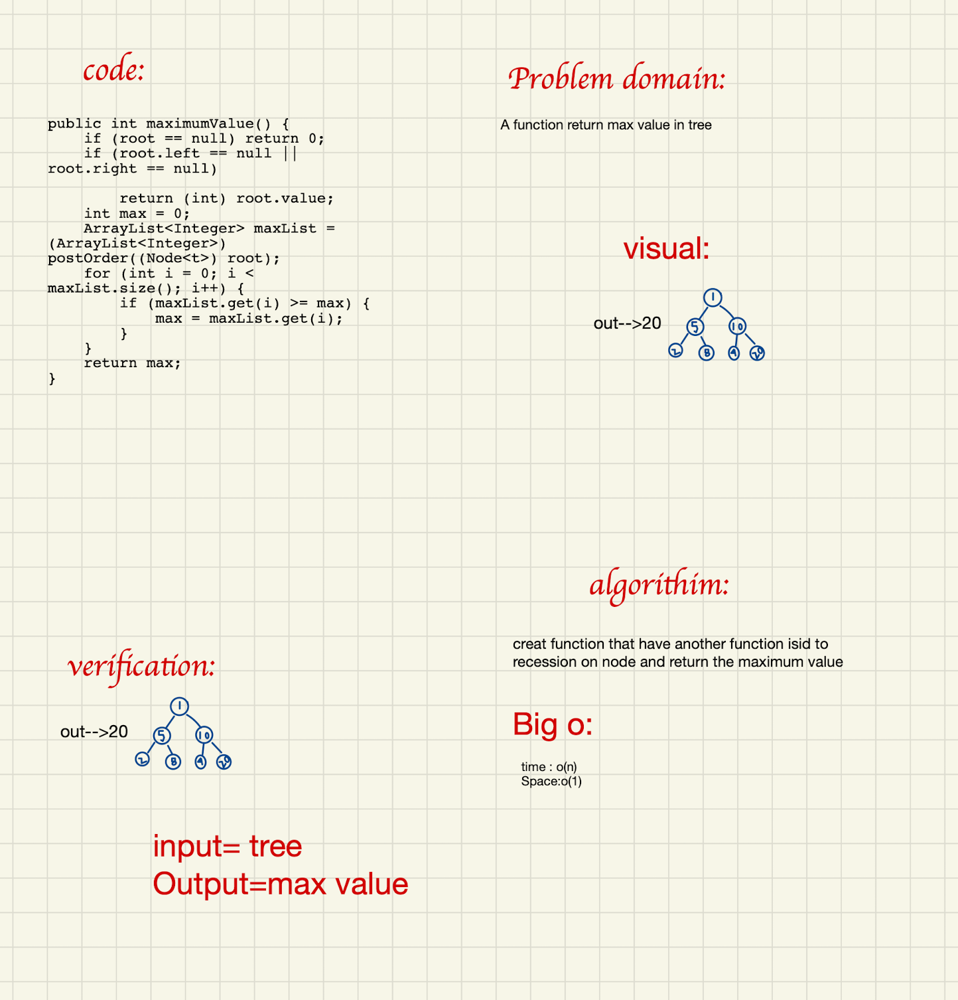
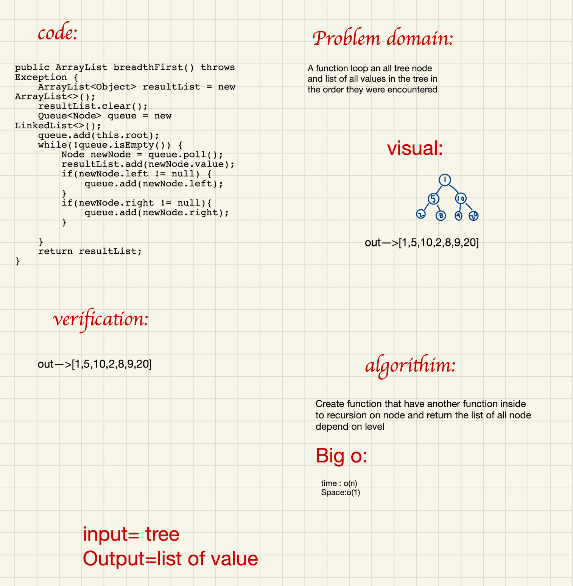
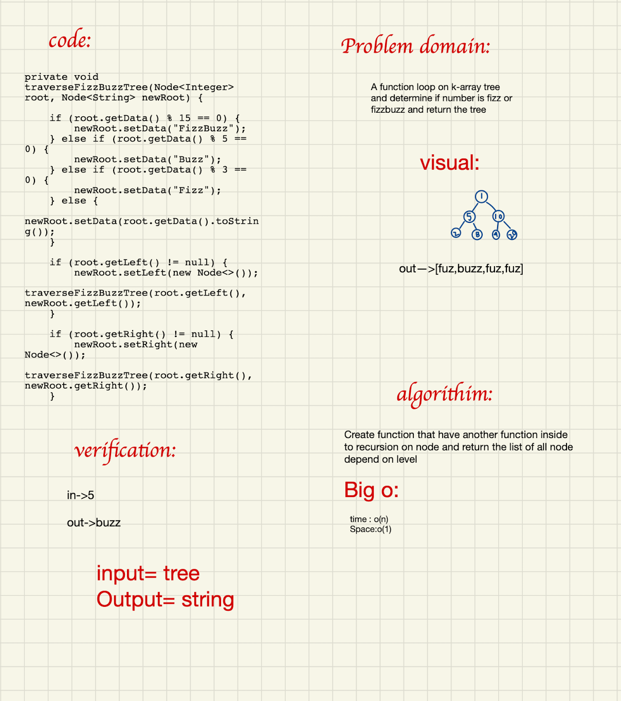

# Trees

<!-- Short summary or background information -->

## Challenge

<!-- Description of the challenge -->

Build all trees classes and methods from scratch

## Approach & Efficiency

<!-- What approach did you take? Why? What is the Big O space/time for this approach? -->

* Create a Node class that has properties for the `data` stored in the node, the
  `left` child node, and the `right` child node.

* Create a BinaryTree class ,define a method for each of the depth first traversals
  called `inOrderTraverse`
  , `postOrderTraverse`, and
  `preOrderTraverse` which returns an array of the values, ordered appropriately.

* Create a BinarySearchTree class define a method named add that accepts a new node, and data with
  that data in the correct location in the binary search tree, define a method named contains that
  accepts a data, and returns a boolean indicating whether the data is in the tree at least once.

## API

<!-- Description of each method publicly available in each of your trees -->

* Class BinaryTree
    * `getRoot()` to get your root
    * `setRoot()` to set your root and insert a node inet
    * `inOrderTraverse()` send your root to get a data sorted left-root-right
    * `postOrderTraverse()` send your root to get a data sorted root-left-right
    * `preOrderTraverse()` send your root to get a data sorted left-right-root

* Class BinarySearchTree
    * `add()` insert in your tree u send just data.
    * `traverse()` get your root and start for cat in half a tree to insert your data inet
    * `contains()` to get a `boolean` true or false after search in your tree
    * `comparison()` reseve a root and data to start search

# Challenge Summary

## Approach & Efficiency

<!-- What approach did you take? Why? What is the Big O space/time for this approach? -->

* Big O of O(n)

## Solution

<!-- Show how to run your code, and examples of it in action -->

# Challenge Summary

<!-- Description of the challenge -->

## Whiteboard Process

## Approach & Efficiency

<!-- What approach did you take? Why? What is the Big O space/time for this approach? -->

* Big O of O(n^1)

## Solution

<!-- Show how to run your code, and examples of it in action -->

# Challenge Summary

<!-- Description of the challenge -->

A binary tree is used to solve the Fizz Buzz issue. Map each value in a tree of integers to a tree
of strings with the same structure using the reasoning below.

## Whiteboard Process

## Approach & Efficiency

<!-- What approach did you take? Why? What is the Big O space/time for this approach? -->

time/space complexity O(n)

